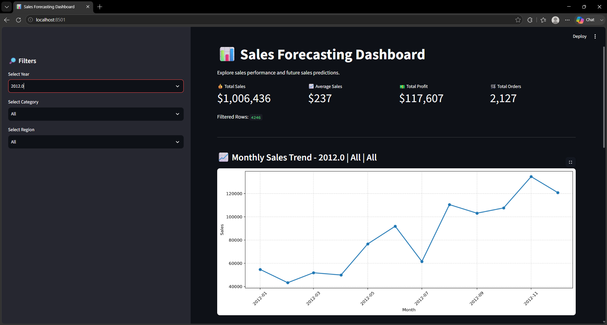
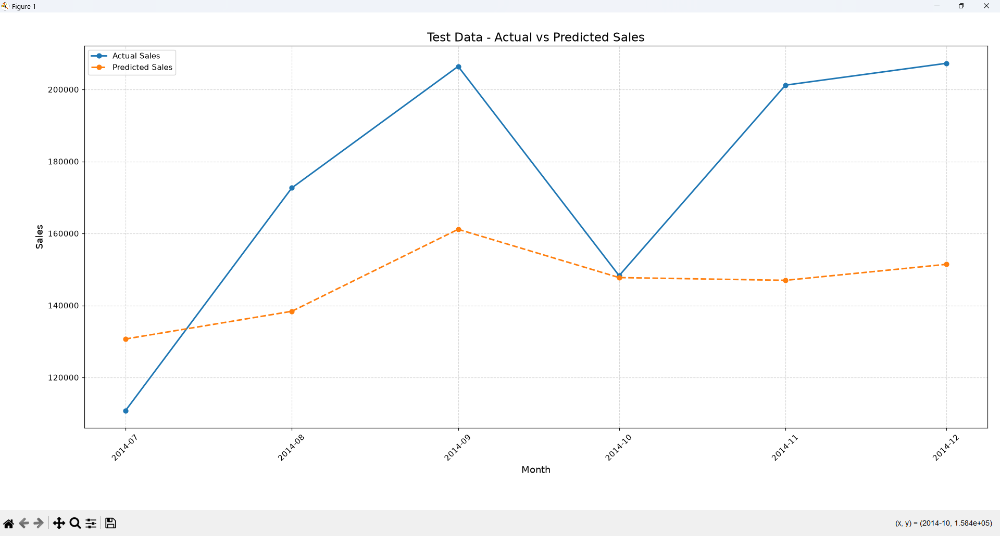
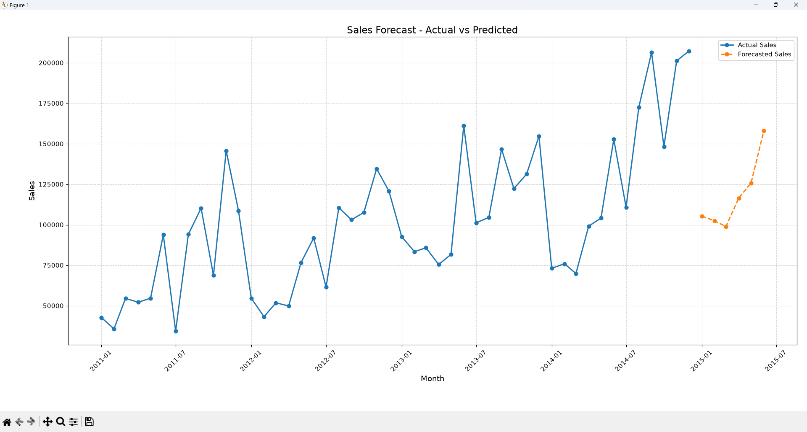

# 📊 Sales Forecasting Dashboard

<div align="center">

<p align="center">
  
</p>

<br>


</div>

---

## 🎯 About the Project

**Sales Forecasting Dashboard** is an interactive **Data Analytics + Machine Learning** project developed as part of the **Grass Internship Project**.

It analyzes historical sales data, presents key business insights through visualizations, and predicts **sales for the next 6 months** using Machine Learning.

> 📊 **Analyze → Visualize → Predict → Decide**

---

## ✨ Key Features

* 📊 **Interactive Dashboard** with a clean Streamlit interface
* 🔎 **Dynamic Filters** — Year, Category & Region
* 💰 **KPI Analysis** — Sales, Average Sales, Profit & Orders
* 📈 **Monthly Sales Trend**
* 🏷️ **Category-wise Sales & Profit**
* 🌎 **Region-wise Sales Analysis**
* 🔮 **6-Month Sales Forecast**
* 🎯 **Model Evaluation** using MAE & RMSE
* ⚠️ Handles insufficient historical data without crashing

---

## 🧠 Machine Learning

**Model:** Linear Regression

**Features:**

* Month number
* Monthly trend
* Previous year's sales
* Seasonal sine & cosine features

```text
Historical Data
      ↓
Data Preparation
      ↓
Feature Engineering
      ↓
Linear Regression
      ↓
MAE + RMSE Evaluation
      ↓
🔮 6-Month Forecast
```

---

## 📊 Insights Provided

| Analysis           | Purpose                    |
| ------------------ | -------------------------- |
| 📈 Monthly Sales   | Identify sales trends      |
| 🏷️ Category Sales | Compare product categories |
| 🌎 Regional Sales  | Identify strong regions    |
| 💵 Category Profit | Understand profitability   |
| 🔮 Forecast        | Estimate future sales      |

---

## 💡 Importance & Advantages

### Why is it Important?

Sales forecasting helps businesses with **inventory planning, revenue estimation, performance tracking, budgeting and future decision-making**.

### 🚀 Advantages

* ⚡ Easy and interactive to use
* 📊 Converts raw data into visual insights
* 🔎 Supports dynamic data analysis
* 🤖 Provides ML-based predictions
* 🎯 Measures model performance
* ⏳ Saves analysis time
* 📈 Supports data-driven decisions
* 🔧 Can be extended with advanced forecasting models

---

## 🛠️ Tech Stack

**Python** • **Pandas** • **NumPy** • **Matplotlib**
**Scikit-learn** • **Streamlit** • **Jupyter Notebook**

---

## 📂 Project Structure

```text
GrassInternship_Project/
│
├── 📁 data/
│   ├── raw/
│   └── processed/
├── 📁 notebooks/
├── 📁 src/
├── 📁 dashboard/
│   └── app.py
├── 📁 models/
├── 📁 outputs/
│   ├── plots/
│   └── reports/
├── 📄 requirements.txt
└── 📄 README.md
```

---

## ⚡ Run Locally

```bash
git clone <your-repository-url>
cd GrassInternship_Project

python -m venv venv
venv\Scripts\activate

pip install -r requirements.txt

streamlit run dashboard/app.py
```

---

## 🌐 Deployment

The dashboard is designed for deployment using **Streamlit Community Cloud**.

**Main App:** `dashboard/app.py`

🚀 **Live Dashboard:** Coming Soon

---

## 📸 Dashboard Preview

<div align="center">

### 📊 Dashboard Overview



<br><br>

### 📈 Actual vs Predicted Sales



<br><br>

### 🔮 Sales Forecast



</div>

---

## 🎓 Project Objective

To build a practical application that combines **Data Analysis, Data Visualization and Machine Learning** to understand historical sales and forecast future performance.

> **Understand the past → Analyze the present → Predict the future.** 🔮

---

## 👩‍💻 Author

<div align="center">

### **Chhavi Chhipa**

🎓 B.Tech — Artificial Intelligence & Data Science

🌱 **Grass Internship Project**

</div>

---

## ⭐ Support

If you like this project, don't forget to **⭐ Star the repository!**

---

<br>

<div align="center">

# 🌅 Thanks for Exploring!


### ☀️ Chasing Ideas • Building Dreams • Creating the Future

**Made with ❤️, Python & a little bit of curiosity.**

</div>
